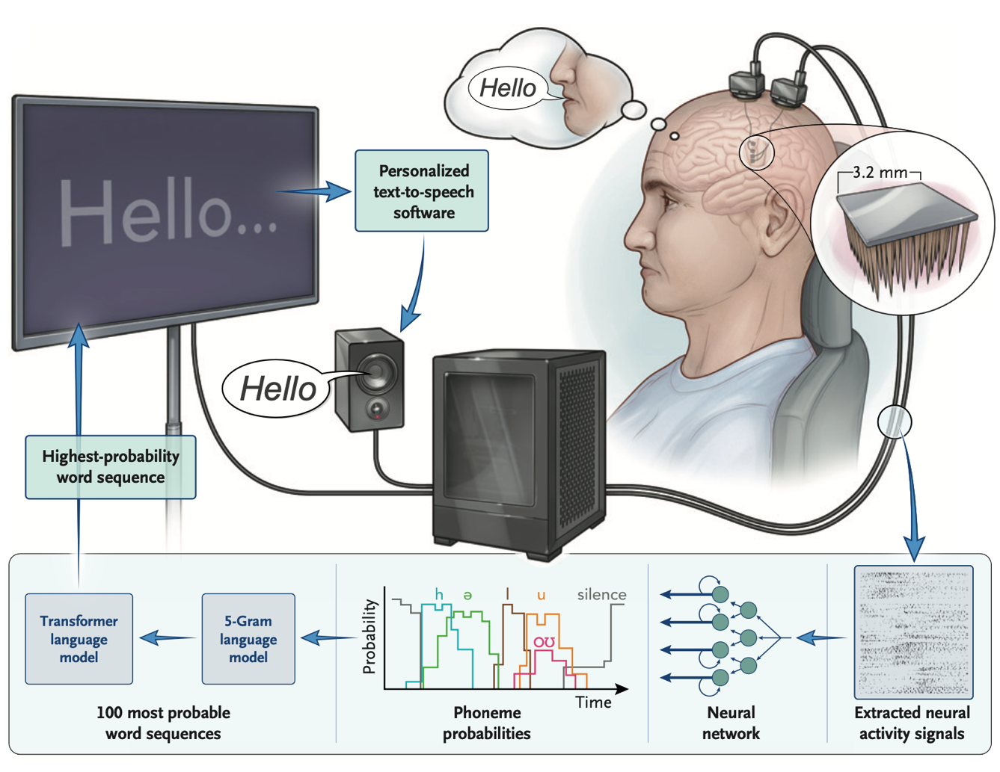

# Brain To Text 25 | DL FA25 | Group Project



## Competition
This repository includes our model training and evaluation code for the [Brain-to-Text '25 Competition](https://www.kaggle.com/competitions/brain-to-text-25).

## Overview
This repository contains the code and data built on top of the baseline shared in the paper ["*An Accurate and Rapidly Calibrating Speech Neuroprosthesis*" by Card et al. (2024), *N Eng J Med*](https://www.nejm.org/doi/full/10.1056/NEJMoa2314132).

The code is organized into five main directories: `utils`, `misc`, `data`, `models`:
- The `utils` directory contains utility functions used throughout the code.
- The `misc` directory contains abstract notebooks which contain analysis of data / model / other explorations.
- The `data` directory contains the data necessary to reproduce the results in the paper. Download it from Dryad using the link above and place it in this directory.
- The `models` directory contains the code necessary to train and evaluate the brain-to-text model.

## Data
### Data Overview
The data used in this repository (which can be downloaded from [Dryad](https://datadryad.org/stash/dataset/doi:10.5061/dryad.dncjsxm85), either manually from the website, or using `download_data.py`) consists of various datasets for recreating figures and training/evaluating the brain-to-text model:
- `t15_copyTask.pkl`: This file contains the online Copy Task results required for generating Figure 2.
- `t15_personalUse.pkl`: This file contains the Conversation Mode data required for generating Figure 4.
- `t15_copyTask_neuralData.zip`: This dataset contains the neural data for the Copy Task.
    - There are 10,948 sentences from 45 sessions spanning 20 months. Each trial of data includes: 
        - The session date, block number, and trial number
        - 512 neural features (2 features [-4.5 RMS threshold crossings and spike band power] per electrode, 256 electrodes), binned at 20 ms resolution. The data were recorded from the speech motor cortex via four high-density microelectrode arrays (64 electrodes each). The 512 features are ordered as follows in all data files: 
            - 0-64: ventral 6v threshold crossings
            - 65-128: area 4 threshold crossings
            - 129-192: 55b threshold crossings
            - 193-256: dorsal 6v threshold crossings
            - 257-320: ventral 6v spike band power
            - 321-384: area 4 spike band power
            - 385-448: 55b spike band power
            - 449-512: dorsal 6v spike band power
        - The ground truth sentence label
        - The ground truth phoneme sequence label
    - The data is split into training, validation, and test sets. The test set does not include ground truth sentence or phoneme labels.
    - Data for each session/split is stored in `.hdf5` files. An example of how to load this data using the Python `h5py` library is provided in the [`model_training/evaluate_model_helpers.py`](model_training/evaluate_model_helpers.py) file in the `load_h5py_file()` function.
    - Each block of data contains sentences drawn from a range of corpuses (Switchboard, OpenWebText2, a 50-word corpus, a custom frequent-word corpus, and a corpus of random word sequences). Furthermore, the majority of the data is during attempted vocalized speaking, but some of it is during attempted silent speaking. [`data/t15_copyTaskData_description.csv`](data/t15_copyTaskData_description.csv) contains a block-by-block description of the Copy Task data, including the session date, block number, number of trials, the corpus used, and what split the data is in (train, val, or test). The speaking strategy for each block is intentionally not listed here.
- `t15_pretrained_rnn_baseline.zip`: This dataset contains the pretrained RNN baseline model checkpoint and args. An example of how to load this model and use it for inference is provided in the [`model_training/evaluate_model.py`](model_training/evaluate_model.py) file.

### Data Directory Structure
Please download these datasets from [Dryad](https://datadryad.org/stash/dataset/doi:10.5061/dryad.dncjsxm85) and place them in the `data` directory. Be sure to unzip `t15_copyTask_neuralData.zip` and place the resulting `hdf5_data_final` folder into the `data` directory. Likewise, unzip `t15_pretrained_rnn_baseline.zip` and place the resulting `t15_pretrained_rnn_baseline` folder into the `data` directory. The final directory structure should look like this:
```
data/
├── t15_copyTask.pkl
├── t15_personalUse.pkl
├── hdf5_data_final/
│   ├── t15.2023.08.11/
│   │   ├── data_train.hdf5
│   ├── t15.2023.08.13/
│   │   ├── data_train.hdf5
│   │   ├── data_val.hdf5
│   │   ├── data_test.hdf5
│   ├── ...
├── t15_pretrained_rnn_baseline/
│   ├── checkpoint/
│   │   ├── args.yaml
│   │   ├── best_checkpoint
│   ├── training_log
```

## Quick Setup

1.  **Install uv:**
    ```bash
    pip install uv
    ```

2.  **Create a virtual environment:**
    ```bash
    uv venv
    ```

3.  **Activate the virtual environment:**
    - On macOS and Linux:
      ```bash
      source .venv/bin/activate
      ```
    - On Windows:
      ```bash
      .venv\Scripts\activate
      ```

4.  **Install dependencies:**
    ```bash
    uv sync
    ```
